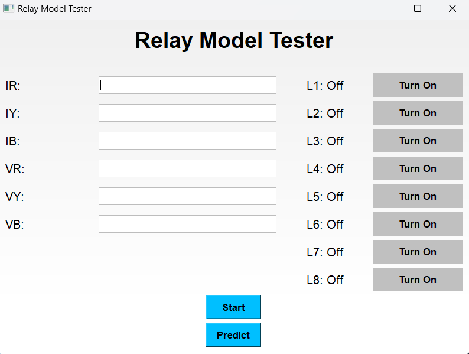
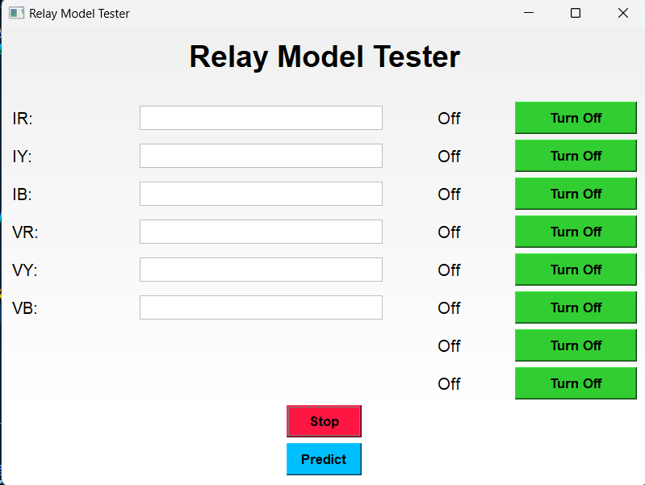
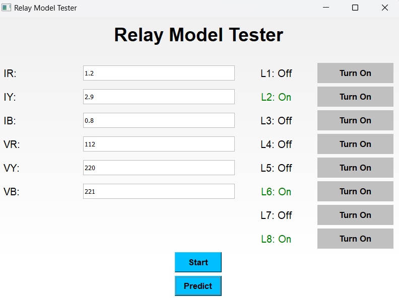

# Relay Control Application

This is a Python application designed for controlling relay outputs based on predicted values using a machine learning model. The application provides an intuitive graphical user interface (GUI) for users to input parameters, toggle relays manually, and observe the predicted relay states.

### Author:
**Aaron Abraham Athiyalil**  
**Registration No:** 2260822  
**Department of Electrical and Electronics Engineering (EEE)**





## Features
- User-friendly interface for inputting current and voltage values.
- Manual toggling of relays with visual feedback on their status.
- Predict relay states based on input parameters using a machine learning model.
- Aesthetic design with responsive layout for various screen sizes.

## Requirements
- Python 3.x
- PyQt5
- NumPy
- Pandas
- Scikit-learn
- Joblib

You can install the required packages using pip:

```bash
pip install PyQt5 numpy pandas scikit-learn joblib
```

## Usage
1. Clone the repository:
   ```bash
   git clone https://github.com/Aaron-Abraham-Athiyalil/Relay-Control.git
   cd Relay-Control
   ```
2. Run the application:
   ```bash
   python <testuipqt>.py
   ```
3. Input the values for IR, IY, IB, VR, VY, and VB in the provided text fields.
4. Use the "Start" button to begin the prediction process.
5. Use the "Predict" button to toggle the relay states based on the model's predictions.
6. Manually toggle the relay states using the relay buttons.

## Dataset Generation
The application includes a dataset generator that creates a synthetic dataset used for training the machine learning model. The generator creates realistic current and voltage values, applies noise to them, and calculates corresponding relay states based on predefined logical conditions.

### Code Explanation:
- **Current and Voltage Generation**: The generator creates synthetic current values ranging from 0 to 10 Amps and voltage values from 220 to 230 Volts, with added Gaussian noise for realism.
- **Power Calculation**: Power is computed as the product of current and voltage.
- **Relay Logic**: Eight relay states (`L1` to `L8`) are generated based on complex conditions involving the current, voltage, and power values.
- **Dataframe Creation**: The data is organized into a pandas DataFrame and shuffled for randomness before being saved as a CSV file.


## Model
The machine learning model used for predictions is implemented in main2.py. It utilizes XGBoost, a powerful library that provides an efficient and flexible implementation of gradient boosting, to predict the states of the relays based on the input features.
## License
This project is licensed under the MIT License - see the [LICENSE](LICENSE) file for details.

## Acknowledgments
- Special thanks to the contributors and libraries used in this project.
- This project was developed as part of the coursework for the Department of Electrical and Electronics Engineering by Dr.Venkataswamy R.
